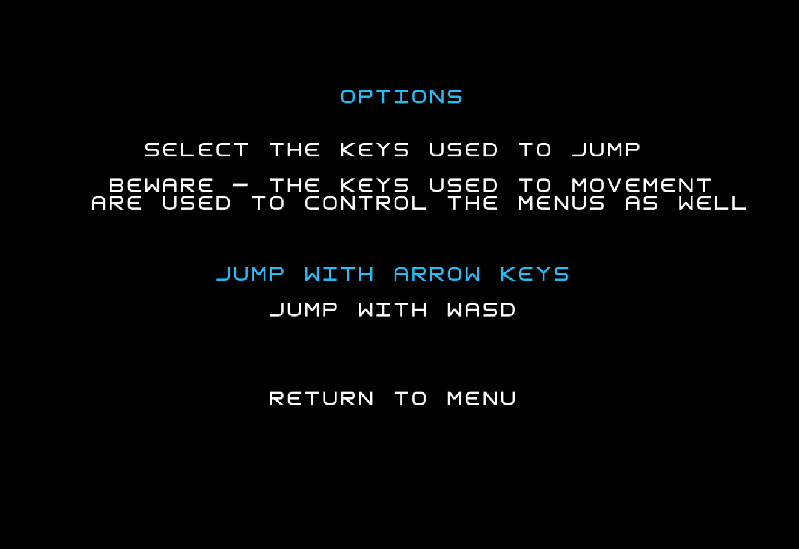
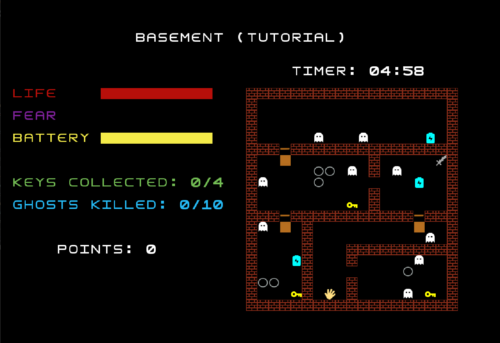
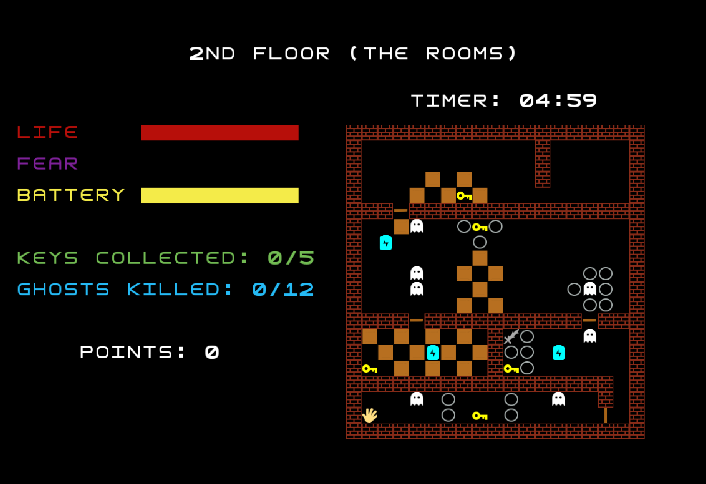
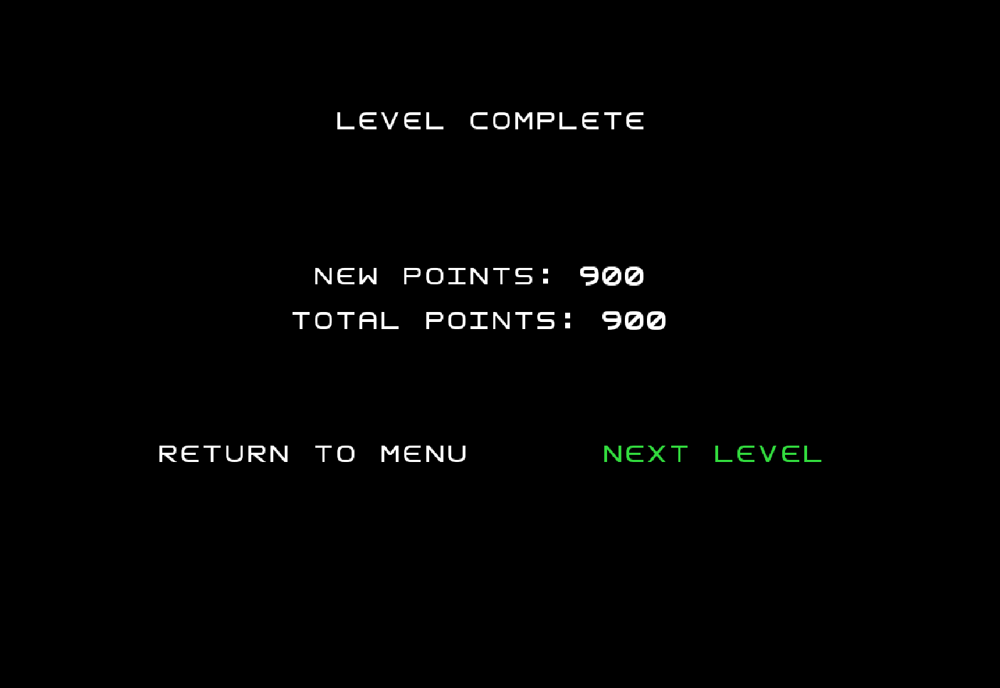

# LPOO_11 - Escape the Mansion

"Escape the Mansion" is a puzzle-strategy game where the player is trapped in a haunted mansion.
In order to win, the player must escape it while running from ghosts and collecting various items to unlock
all the levels (represented by floors).

Our idea was inspired by *Escape Room* games and also the game *Luigi's Mansion*.

This project was developed by Ana Matilde Barra (up201904795@fe.up.pt), Ângela Coelho (up201907549@fe.up.pt) and Nuno Castro (up202003324@fe.up.pt) for LPOO 2020⁄21.

--- 
## Table of contents

1. [Implemented Features](https://github.com/FEUP-LPOO-2021/lpoo-2021-g11/tree/main/docs#implemented-features)
2. [Planned Features](https://github.com/FEUP-LPOO-2021/lpoo-2021-g11/tree/main/docs#planned-features)
3. [Design](https://github.com/FEUP-LPOO-2021/lpoo-2021-g11/tree/main/docs#design)
4. [Known Code Smells and Refactoring Suggestion](https://github.com/FEUP-LPOO-2021/lpoo-2021-g11/tree/main/docs#known-code-smells-and-refactoring-suggestions)
5. [Testing](https://github.com/FEUP-LPOO-2021/lpoo-2021-g11/tree/main/docs#testing)
6. [Self-Evaluation](https://github.com/FEUP-LPOO-2021/lpoo-2021-g11/tree/main/docs#self-evaluation)

---
## Implemented Features

#### Elements:
- Player (movable element that we control);
- Wall (unmovable element that cannot be crossed through);
- Ghost (represents an enemy, with random movements);
- Key (unmovable element that has to be collected);
- Door (unmovable element that 'disappears' through the collection of a key - "the doors can be opened");
- Box (movable element - "the boxes move if we push them");
- EndLevel (unmovable element that represents the end of a level - only visible when all the keys are collected and therefore all the doors are open); 
- Weapon ('collectable' element - the player 'becomes' the weapon and attacks ghosts by moving in their direction);
- Battery (unmovable element that can be collected - to increment the flashlight battery).

#### Element Collision:
  - The Player cannot move through walls, closed doors, ghosts, boxes and holes. However, it is possible to move boxes by pushing them and it is possible to jump above holes on the level floor.
  - Ghosts can move through holes, but cannot move through walls, doors, boxes or keys. Besides that, they can move "above" Weapons, EndLevel elements 
  - Boxes can be placed above holes, when they are in that position, they are no longer movable, because if the player tries to move them, he fells in the hole and dies.

#### Graphic Interface:
- At the moment, we have implemented the graphic interface Lanterna, which allows us to draw all our elements;
- We now have several menus: "Menu", "Pause", "Options", "GameOver", "Level Complete" and "Game Complete", each one with its different options to select.
- The Pause Menu and the GameOver Menu allow the player to restart the current level;
- The game can only be closed through the Menu option "Quit" - the window is closed and the process terminates successfully.
- The game map is viewed from the top;
- The map is loaded from a *.map file.
- The vision field of a certain level changes accordingly to the level of battery the player has. There is a minimum value so that even if the battery reaches 0, the player can still complete the level.


#### Player Movement:
- The Player can be moved with the arrow keys (up, down, left, right) and jump in a specific direction with WASD (W - up, A - left, S - down, D - right).
- In the "Options" menu we can choose what is the type of keys we want to use to jump (Arrow keys or WASD). That choice influences the keys used for movement in game and in the menus as well.

#### Player Components
The player has three component bars visible in the game screen: *Life*, *Fear* and *Battery*:
  - *Life* - decreases if the player collides with ghosts;
  - *Fear* - increases with the collision of the player with ghosts as well;
  - *Battery* - FlashLight battery - decreases with the passage of time and increases with the capture of battery elements.

#### Timer

We implemented a timer that limits the time the player has to 'escape' each level, increasing the difficulty of each level.
The Timer influences the fear and the battery player components (decreasing them) every 30 seconds.

### Screenshots

- Main Menu    
  

- Options Menu   
  
  
- Basement Level    
  

- 1st Floor Level   
  

- 2nd Floor Level   
  

- Attic Level  
  

- Pause Menu      
  

- Game Over      
  

- Level Complete  
  

- Game Complete  
  
  
### Gif


## Planned Features

The bulleted points with the checkmark are the features that we were able to implement at the time of delivery.

#### Map Related :

- [x]  Top-view of the map; 
  
- [x] Mansion with different floors (our levels) each with a different floor-plan (different rooms). This leads to the existence of doors to open with the clues/items collected (in the beginning only the door to the 1st room is open);
  
- [ ] To opens the last door of the floor and be able to go "up", the player needs to solve a final riddle with all the collected clues until that point;

- [x] Holes on the ground;

- [ ] Each "repeated" level may have its map randomly generated so that each time the same level is played, the story reamins the same but the items are in different places;

- Levels to implement (different lighting, number of ghosts, type of enemy):
    - [x] Basement - Tutorial, has lighting - teach the controls and the mechanics of the game;
    - [x] 1st floor - 'easy' level, solve the first puzzle, 10 ghosts, light in the whole level; (without puzzles)
    - [x] 2nd floor - 'medium' level, solve a trickier puzzle, more ghosts, light in half the level;  (without puzzles)
    - [x] Attic - 'hard' level, to solve the hardest puzzle the player will have to fight a ghost BigBoss (the owner of the mansion?), stronger than all the other ghosts;  (without puzzles or boss)
    - [ ] Patio - find a hidden key and open the final gate, show the final credits and then open a level “hub” - so that we can repeat the levels we want by any order.

#### Item related:

- [x] Collect Clues/Catch items (keys, flashlights, weapons);

- [ ] Clues with text/numbers on screen;

- [X] Different vision field in accordance to battery of the flashlight;

- [ ] Turn the flashlight on or off with a keystroke on a specific keyboard key;

- [ ] Items 'shop' in the 'elevator' between different mansion levels - to buy flashlight improvements, new weapons, new flashlight batteries;

- [ ] 'Potions' to reset the normal levels of fear (0), life (100) and flashlight battery (100) (names: courage, life, newBatteries, etc) - some stronger than the others;

- [x] The weapon has a damage value;

- [ ] Attack with a click on the left button of the mouse

- [ ] Each Flashlight has an intensity (quantity of light), a battery and a damage value associated; (light only damages the 'small' ghosts)

#### Element related:

- [x] Move obstacles (boxes, furniture) to clear paths;

- [x] Defeat/Catch ghosts (score bonus);

- [x] Limit time to escape;

- [x] Calculate the final level score with the number of keys collected, the number of ghosts defeated (and the time that it takes to leave the level - *not yet*) 

- [x] Life, Fear and battery meters, clues collected counter and ghosts killed counter;

- [ ] When the fear level is above 75, the damage inflicted by ghost attacks is bigger and, because of that our player loses more life and moves slower;

- [ ] Character Inventory - to check the collected clues again;

- [x] Our Player can jump two "cases" - over holes on the floor - with the keys selected in the options menu

- [ ] Dialogs - with the boss and inside the players mind.

### Mockups

- Menu    


- Level    


- Pause     


- Solve the Puzzle    


- Game Over    


- Level Complete    


- Elevator - Item Shop    


- Patio - Levels Menu     


- Game Complete & Credits    


## Design

### Lanterna Facade - Structural Pattern

#### Problem in Context

In this project we are using the Lanterna framework which has lots of features of which we only need a few, e.g. to draw the game elements or the floors. If we used the Laterna's methods directly, the code would be too complex since the classes would become tightly coupled to the implementation details of the framework methods. Therfore, we decided to use the following pattern to avoid this problem.    

#### The Pattern

It was applied the [Facade](https://refactoring.guru/design-patterns/facade) pattern by creating a class with only the relevant features the project development.

#### Implementation

The pattern implementation can be seen in the following image, where the facade is `LanternaGUI`.
  


The classes are located in the following files:

- [GUI](https://github.com/FEUP-LPOO-2021/lpoo-2021-g11/blob/main/src/main/java/com/escapethemansion/gui/GUI.java)

- [LanternaGUI](https://github.com/FEUP-LPOO-2021/lpoo-2021-g11/blob/main/src/main/java/com/escapethemansion/gui/LanternaGUI.java)

#### Consequences

By implementing this pattern we are able to isolate our code from the complexity of the Lanterna framework making our code much more straightforward and avoiding too much knowledge about the framework.    
This pattern also has the con of the facade becoming a 'god object' coupled to all classes of our application, which ends up being a code smell.

### Model-View-Controller (MVC) - Architectural Pattern

#### Problem in Context

For our project we need to store data for elements, draw them and also have a way to control them. If we only had a single file for each element in our game, the classes would be very large and the code would not be very well organized and separated, making it hard to find eventual bugs or make future updates. In lectures and lab classes we were strongly recommended to start our project with this organization system. Considering all this, we decided to apply the MVC pattern.  

#### The Pattern

We applied the [Model-View-Controller](https://web.fe.up.pt/~arestivo/presentation/patterns/#58) pattern by creating 3 directories that divide the classes in models, views and controllers:
- The 'models' store the data of the elements;
- The 'views' enable the display of the elements and send the user actions for the 'controllers';
- The 'controllers' change the state of the elements by interpreting the user actions sent by the 'views' and provide the 'models' data to the 'views'.

#### Implementation

This pattern implementation can be seen in the following image, that shows our code divided in 4 directories (**model**, **view**, **controller** and gui).


#### Consequences
By implementing this architectural pattern we are able to organize our code in a more useful and logic way, which we believe will save us some troubles in the future.
However, as the code was spread through many files, sometimes it was rather time-consuming searching for the one with the code we wanted to change and creating all the classes needed so that an element of our game could be used for the end result.

### State Pattern - Behavioral Pattern (All the Game States)

#### Problem in Context

For our project we wanted to implement various menus.
In the lectures, we observed the teacher using this pattern in order to have an intial menu that initiated his game and allowed access to the "playable area".
By observing that, we decided to apply this pattern in a Model-View-Controller-style to create all the states we wanted for our game.

#### The Pattern

It was applied the [State](https://refactoring.guru/design-patterns/state) pattern in a MVC-style by creating a State, Model, View and Controller for each state we wanted our game to have and allowing it to change state.

#### Implementation

The pattern implementation can be seen in the following image:


With the use of this pattern we are able to have the following game states:
- Menu: <br> In the files: [MenuState](https://github.com/FEUP-LPOO-2021/lpoo-2021-g11/blob/main/src/main/java/com/escapethemansion/state/MenuState.java), [MenuModel](https://github.com/FEUP-LPOO-2021/lpoo-2021-g11/blob/main/src/main/java/com/escapethemansion/model/menu/Menu.java), [MenuViewer](https://github.com/FEUP-LPOO-2021/lpoo-2021-g11/blob/main/src/main/java/com/escapethemansion/viewer/menu/MenuViewer.java) and [MenuController](https://github.com/FEUP-LPOO-2021/lpoo-2021-g11/blob/main/src/main/java/com/escapethemansion/controller/menu/MenuController.java);
- Options: <br> In the files: [OptionState](https://github.com/FEUP-LPOO-2021/lpoo-2021-g11/blob/main/src/main/java/com/escapethemansion/state/OptionState.java), [OptionsModel](https://github.com/FEUP-LPOO-2021/lpoo-2021-g11/blob/main/src/main/java/com/escapethemansion/model/menu/Options.java), [OptionsViewer](https://github.com/FEUP-LPOO-2021/lpoo-2021-g11/blob/main/src/main/java/com/escapethemansion/viewer/menu/OptionsViewer.java) and [OptionsController](https://github.com/FEUP-LPOO-2021/lpoo-2021-g11/blob/main/src/main/java/com/escapethemansion/controller/menu/OptionsController.java);
- Game: <br> In the files: [GameState](https://github.com/FEUP-LPOO-2021/lpoo-2021-g11/blob/main/src/main/java/com/escapethemansion/state/GameState.java), GameModel ([Floor](https://github.com/FEUP-LPOO-2021/lpoo-2021-g11/blob/main/src/main/java/com/escapethemansion/model/game/floor/Floor.java)), [GameViewer](https://github.com/FEUP-LPOO-2021/lpoo-2021-g11/blob/main/src/main/java/com/escapethemansion/viewer/game/GameViewer.java) and GameController ([FloorController](https://github.com/FEUP-LPOO-2021/lpoo-2021-g11/blob/main/src/main/java/com/escapethemansion/controller/game/FloorController.java));
- Pause: <br> In the files: [PauseState](https://github.com/FEUP-LPOO-2021/lpoo-2021-g11/blob/main/src/main/java/com/escapethemansion/state/PauseState.java), [PauseModel](https://github.com/FEUP-LPOO-2021/lpoo-2021-g11/blob/main/src/main/java/com/escapethemansion/model/menu/Pause.java), [PauseViewer](https://github.com/FEUP-LPOO-2021/lpoo-2021-g11/blob/main/src/main/java/com/escapethemansion/viewer/menu/PauseViewer.java) and [PauseController](https://github.com/FEUP-LPOO-2021/lpoo-2021-g11/blob/main/src/main/java/com/escapethemansion/controller/menu/PauseController.java);
- LevelComplete: <br> In the files: [LevelCompleteState](https://github.com/FEUP-LPOO-2021/lpoo-2021-g11/blob/main/src/main/java/com/escapethemansion/state/LevelCompleteState.java), [LevelCompleteModel](https://github.com/FEUP-LPOO-2021/lpoo-2021-g11/blob/main/src/main/java/com/escapethemansion/model/menu/LevelComplete.java), [LevelCompleteViewer](https://github.com/FEUP-LPOO-2021/lpoo-2021-g11/blob/main/src/main/java/com/escapethemansion/viewer/menu/LevelCompleteViewer.java) and [LevelCompleteController](https://github.com/FEUP-LPOO-2021/lpoo-2021-g11/blob/main/src/main/java/com/escapethemansion/controller/menu/LevelCompleteController.java);
- GameOver: <br> In the files: [GameOverState](https://github.com/FEUP-LPOO-2021/lpoo-2021-g11/blob/main/src/main/java/com/escapethemansion/state/GameOverState.java), [GameOverModel](https://github.com/FEUP-LPOO-2021/lpoo-2021-g11/blob/main/src/main/java/com/escapethemansion/model/menu/GameOver.java), [GameOverViewer](https://github.com/FEUP-LPOO-2021/lpoo-2021-g11/blob/main/src/main/java/com/escapethemansion/viewer/menu/GameOverViewer.java) and [GameOverController](https://github.com/FEUP-LPOO-2021/lpoo-2021-g11/blob/main/src/main/java/com/escapethemansion/controller/menu/GameOverController.java);
- GameComplete: <br> In the files: [GameCompleteState](https://github.com/FEUP-LPOO-2021/lpoo-2021-g11/blob/main/src/main/java/com/escapethemansion/state/GameCompleteState.java), [GameCompleteModel](https://github.com/FEUP-LPOO-2021/lpoo-2021-g11/blob/main/src/main/java/com/escapethemansion/model/menu/GameComplete.java), [GameCompleteViewer](https://github.com/FEUP-LPOO-2021/lpoo-2021-g11/blob/main/src/main/java/com/escapethemansion/viewer/menu/GameCompleteViewer.java) and [GameCompleteController](https://github.com/FEUP-LPOO-2021/lpoo-2021-g11/blob/main/src/main/java/com/escapethemansion/controller/menu/GameCompleteController.java).


#### Consequences

The use of this pattern is beneficial to allow us to have different "menus" each with its own graphical interface. It also allows us to add new states to our game in a relatively easy way, without changing existing state classes following the [Open/Closed Principle](https://web.fe.up.pt/~arestivo/presentation/solid/#20).
However, it also increases the number of files in our project and leads to a "duplicate code" code smell that we will refer later on. 

## Known Code Smells and Refactoring Suggestions

### Long Method 

  #### Problem

  The method `loadMap()` in the class [`FloorBuilder`](https://github.com/FEUP-LPOO-2021/lpoo-2021-g11/blob/main/src/main/java/com/escapethemansion/model/floor/FloorBuilder.java), which is responsible to read a floor map from a text file, contains
  too many lines of code.

  ```java
    public void loadMap(BufferedReader mapReader) throws IOException {
      this.title = loadTitle(mapReader);
      this.offset = loadOffset(mapReader);
  
      String line;
      int numLine = 0;
      int numCol = 0;
  
      for(; (line = mapReader.readLine()) != null; numLine++) {
        for(numCol = 0; numCol < line.length(); numCol++) {
            String c = String.valueOf(line.charAt(numCol));
            Position position = this.offset.add(new Position(numCol, numLine));
  
            switch (c) {
              case "#":
                this.walls.add(new Wall(position));
                break;
        
              case "G":
                this.ghosts.add(new Ghost(position));
                break;
        
              case "X":
                this.player = new Player(position);
                break;
        
              case "K":
                this.keys.add(new Key(position));
                break;
        
              case "-":
                this.doors.add(new Door(position, false));
                break;
        
              case "|":
                this.doors.add(new Door(position, true));
                break;
        
              case "P":
                this.levelEnd = new EndLevel(position);
                break;
        
              case "B":
                this.boxes.add(new Box(position));
                break;
        
              case "H":
                this.holes.add(new Hole(position));
                break;
        
              case "F":
                this.batteries.add(new Battery(position));
                break;
        
              case "W":
                this.weapon = (new Weapon(position));
                break;
  
              default:
                break;
            }
        }
      }
      this.width = numCol;
      this.height = numLine;
    }
  ```
  
  #### Refactoring Suggestion

  We ended up not 'eliminating' this code smell, but the one possible solution would be the [Exctract Method](https://refactoring.guru/extract-method).
  In other words, one way to solve this would be to divide the method into smaller pieces. This would be done by moving parts of the code into separate methods and then replace the old code with calls to these new methods.    

### Large Class

  #### Problem

  Once again, the problem lies in the class [`FloorBuilder`](https://github.com/FEUP-LPOO-2021/lpoo-2021-g11/blob/main/src/main/java/com/escapethemansion/model/floor/FloorBuilder.java) which contains many fields/lines of code. That can be seen just
  by looking at its 14 fields below.
  
  ```java
    private int width;
    private int height;
    private final List<Wall> walls;
    private final List<Ghost> ghosts;
    private final List<Key> keys;
    private final List<Door> doors;
    private final List<Hole> holes;
    private final List<Battery> batteries;
    private EndLevel levelEnd;
    private final List<Box> boxes;
    private Player player;
    private Weapon weapon;
    private Position offset;
    private String title;
  ```
 
  #### Refactoring Suggestion

  We ended up not eliminating this code smell as well. Therefore, we have not implemented a solution for this code smell, but the [Extract Class](https://refactoring.guru/extract-class) method seems a good way to solve it. This would be done be creating new classes and place the fields and methods responsible for the relevant functionality in it.     

### Duplicate Code

  #### Problem
    
  This problem is present in two situations:
- In class `Options Controller` it is used two different methods to update used keys, that are basically the same code as it can be seen in the
  fragment of code below.
  
  ```java
    public void updateJumpKeysWASD() {
      gui.getKeyAction().replace(KeyType.ArrowUp, GUI.ACTION.UP);
      gui.getKeyAction().replace(KeyType.ArrowDown, GUI.ACTION.DOWN);
      gui.getKeyAction().replace(KeyType.ArrowLeft, GUI.ACTION.LEFT);
      gui.getKeyAction().replace(KeyType.ArrowRight, GUI.ACTION.RIGHT);
  
      gui.getCharAction().replace('w', GUI.ACTION.JUMPUP);
      gui.getCharAction().replace('s', GUI.ACTION.JUMPDOWN);
      gui.getCharAction().replace('a', GUI.ACTION.JUMPLEFT);
      gui.getCharAction().replace('d', GUI.ACTION.JUMPRIGHT);
      }

    public void updateJumpKeysArrows() {
      gui.getKeyAction().replace(KeyType.ArrowUp, GUI.ACTION.JUMPUP);
      gui.getKeyAction().replace(KeyType.ArrowDown, GUI.ACTION.JUMPDOWN);
      gui.getKeyAction().replace(KeyType.ArrowLeft, GUI.ACTION.JUMPLEFT);
      gui.getKeyAction().replace(KeyType.ArrowRight, GUI.ACTION.JUMPRIGHT);

      gui.getCharAction().replace('w', GUI.ACTION.UP);
      gui.getCharAction().replace('s', GUI.ACTION.DOWN);
      gui.getCharAction().replace('a', GUI.ACTION.LEFT);
      gui.getCharAction().replace('d', GUI.ACTION.RIGHT);
    }
  ```

- In all the `<State>Controller` classes, there is a switch statement with the same structure but different conditions 
  in the case `SELECT`. These classes can be found in the package [controller/menu](https://github.com/FEUP-LPOO-2021/lpoo-2021-g11/blob/main/src/main/java/com/escapethemansion/controller/menu).

  #### Refactoring Suggestion
- We once again ended up maintaining this code smell since we didn't find any solution accordingly to our code structure.
However, one possible way of eliminating this code smell would be using the State pattern mentioned before, by saving the 
  current state of the key options and then only swap them in case the player changed it.
  
- Finally, for the other situation we also didn't get rid of the code smell because we consider this to be the best way
of implementing it.


## Testing

  ### Screenshot of the Gradle test summary  


For more detailed information click [here](https://paginas.fe.up.pt/~up201907549/lpoo/test_reports/gradle/) to open the report.


 ### Screenshot of the JaCoCo coverage test summary

For more detailed information click [here](https://paginas.fe.up.pt/~up201907549/lpoo/test_reports/jacoco/) to open the report.

## Self-Evaluation

| Name                | Number    | Self-Evaluation |
| ------------------- | --------- | --------------- |
| Ana Matilde Barra   | 201904795 |        33,3%    |
| Ângela Coelho       | 201907549 |        33,3%    |
| Nuno Castro         | 202003324 |        33,3%    |


